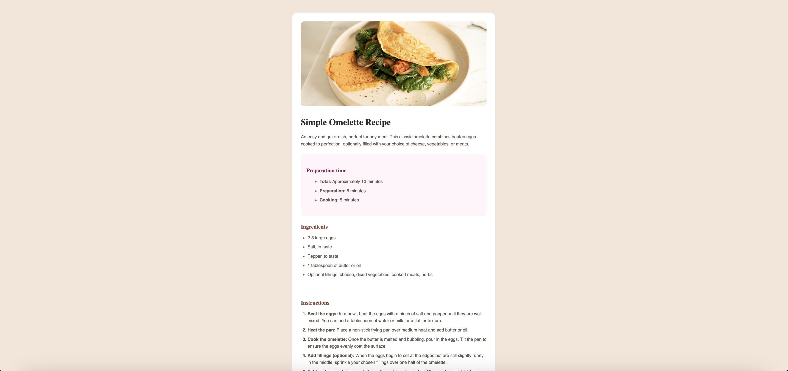

# Frontend Mentor - Recipe page solution

This is a solution to the [Recipe page challenge on Frontend Mentor](https://www.frontendmentor.io/challenges/recipe-page-KiTsR8QQKm). Frontend Mentor challenges help you improve your coding skills by building realistic projects.

## Table of contents

- [Overview](#overview)
  - [The challenge](#the-challenge)
  - [Screenshot](#screenshot)
  - [Links](#links)
- [My process](#my-process)
  - [Built with](#built-with)
  - [What I learned](#what-i-learned)
  - [Continued development](#continued-development)
  - [Useful resources](#useful-resources)
- [Author](#author)

## Overview

### The challenge

Users should be able to:
- View the optimal layout for the recipe page depending on their device's screen size
- See hover and focus states for all interactive elements on the page

### Screenshot



### Links

- Solution URL: [Recipe Page Solution](https://github.com/glrodriperez98/recipe-page)
- Live Site URL: [Recipe Page Live](https://glrodriperez98.github.io/recipe-page/)

## My process

### Built with

- Semantic HTML5 markup
- CSS custom properties
- Flexbox
- Mobile-first workflow
- Media queries for responsiveness

### What I learned

One of the biggest takeaways from this project was learning how to write responsive CSS using media queries. This helped me make sure that the layout adapts well on both mobile and desktop screens.

Here's the snippet I used to improve responsiveness:

```
css
@media (max-width: 600px) {
  .card {
    padding: 1.5rem;
  }

  h1 {
    font-size: 1.75rem;
  }

  h2 {
    font-size: 1.1rem;
  }

  body {
    padding: 2rem 1rem;
  }
}
```

This is the first time I've really used `@media` effectively in a project, and I can already see how powerful it is for creating smooth, responsive designs.

### Continued development

In future projects, I’d like to get more comfortable with:
- CSS Grid and when to use it over Flexbox
- Improving accessibility using better semantic markup
- Using utility-first CSS frameworks like Tailwind CSS

### Useful resources

- [CSS-Tricks Media Queries Guide](https://css-tricks.com/snippets/css/media-queries-for-standard-devices/) - A great reference for writing media queries for various screen sizes.
- [MDN Web Docs - Responsive Design](https://developer.mozilla.org/en-US/docs/Learn/CSS/CSS_layout/Responsive_Design) - Helped reinforce core concepts of responsive layouts.

## Author

Gabriel L. Rodriguez Perez

- Frontend Mentor - [@glrodriperez98](https://www.frontendmentor.io/profile/glrodriperez98)
- GitHub - [@glrodriperez98](https://github.com/glrodriperez98)

